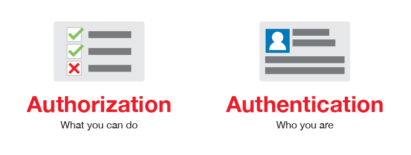

# How to use Flipside out of Flipside


<center>
<a href='https://eferbarn.notion.site/eferbarn/How-to-use-Flipside-out-of-Flipside-68a7be55e7be48deb12f270634d5d551'>

</a>
</center>

# Introduction

There are many interfaces to interact with a web service. **GUI**s$^1$ are the most common interfaces to use a service on the web, but they are not the only choices.

So what are alternatives? Cha-Ching! API is here.

Technically speaking, **API** (**A**pplication **P**rogramming **I**nterface**)** is a collection of communication protocols and subroutines used by various programs to communicate between technology products such as applications and websites. 

Practically speaking, APIs are the basis of much of what keeps people digitally connected. From apps on our phones to complicated flight control systems, APIs bring otherwise disparate systems together to create single platforms. They allow applications or IoT devices to access data and create gateways to interact with external systems.

In other words, APIs help you to interact with your desired services and automate your actions through computer programs, in a delightful neat way.

1. **GUI** stands for **G**raphical **U**ser **I**nterface. It is a software platform that allows users to interact with web services via visual indicator representations.

# Some of the d**ifferences between API and GUI**

| No. | API | GUI |
| --- | --- | --- |
| 1 | An API permits communication between two programs. | GUI allows interaction between a human and a computer program. |
| 2 | APIs require high technical skills to leverage. | GUI doesn’t require too much technical know-how or the need to leverage. |
| 3 | APIs tests are fast in action. | GUIs tests tend to take longer. |
| 4 | API is cheaper. | GUI is expensive. |
| 5 | API allows the exchange of data through XML or JSON. | GUI doesn’t allow the exchange of data through XML or JSON. |
| 6 | API allows more flexibility when it comes to automation and innovation. | GUI is less flexible when it comes to automation and innovation. |

# FlipsideCrypto API

As you probably guessed, the velocity app on FlipsideCrypto is a GUI, backed by a powerful API that allows you to interact with indexed blockchain data provided by Flipside.

Flipside has recently offered ShroomDK NFTs (If you are a developer, the first thing that comes to your mind is **SDK**$^2$). These NFTs serve as API Key generators. Your API Key can be utilized with their language-specific SDKs or directly with the RestAPI. 

1. **SDK** stands for **S**oftware **D**evelopment **K**it. To figure the differences between SDKs and APIs out, see [this link](https://stackoverflow.com/questions/834763/difference-between-an-api-and-sdk).

# Instruction; querying Flipside tables using API


First, let's take a look at some principles.

- Authentication and Authorization
    
    
    
    **Authentication** is when an entity proves an identity. In other words, Authentication proves that you are who you say you are. This is like having a driver license which is given by a trusted authority that the requester, such as a police officer, can use as evidence that suggests you are in fact who you say you are.
    
    **Authorization** is an entirely different concept and in simple terms, Authorization is when an entity proves a right to access. In other words, Authorization proves you have the right to make a request. Consider the following - You have a working key card that allows you to open only some doors in the work area, but not all of them.
    
    **API as a Service:**
    
    APIs serve your applications publicly or privately. If an API is a platform's premium service, you need to authorize your requests. This is applicable with the help of a private key (in this case: ShroomDK API key) authorization process.
    
- Unique_Query_ID
    
    Every query on FlipsideCrypto has a unique ID (generated by Snowflake) that demonstrates which query we are talking about. On the other hand, a link including this ID redirects you to the query page on the velocity app.
    
    For example `6d41c6e2-a5e3-4e64-8337-17ae232f928e` is the unique ID for this query:
    
    [https://app.flipsidecrypto.com/velocity/queries/6d41c6e2-a5e3-4e64-8337-17ae232f928e](https://app.flipsidecrypto.com/velocity/queries/6d41c6e2-a5e3-4e64-8337-17ae232f928e)
    
    
    
    - Note
        
        you can find the link with the unique ID as a URL parameter in this manner:
        
        `https://app.flipsidecrypto.com/velocity/queries/<Unique_Query_ID>`
        
    
    See the following link and hold this as a hint in your mind. 
    
    [https://node-api.flipsidecrypto.com/api/v2/queries/6d41c6e2-a5e3-4e64-8337-17ae232f928e/data/latest](https://node-api.flipsidecrypto.com/api/v2/queries/6d41c6e2-a5e3-4e64-8337-17ae232f928e/data/latest)
    
- API key
    
    In order to interact with Flipside API, you can acquire an API key by following the instructions mentioned [here](https://sdk.flipsidecrypto.xyz/shroomdk).
    

**Mushrooms and spores**


Mushrooms are your key to entering the wonderland

Just click the 👁 button to reveal your specific API key. Then you can use it wherever you want.

P.S.: Be aware of sharing your keys with others.

- Note
    
    
    
    Every user gets 2 free mushrooms
    


Spores boost your mushroom to extend their limitations like daily usage limit

## 1. If you are a JS developer

### a. Using public API and unique ID

- What is a REST API?
    
    There are many styles and varieties of APIs, but the most popular type is “REST API.” The RESTful API standard offers app developers a variety of commands to work with. These commands trigger different HTTP requests in the app or service that the REST API was created for.
    
    According to [resfulapi.net](https://restfulapi.net/http-methods/):
    
    *REST APIs enable you to develop any kind of web application having all possible CRUD (create, retrieve, update, delete) operations. REST guidelines suggest using a specific HTTP method on a specific type of call made to the server (though technically it is possible to violate this guideline, yet it is highly discouraged).*
    
    In other words, REST APIs offer a standardized set of “protocols, routines, functions, or commands” ****that two applications can use and rely on for the purpose of integrating with each other. Here are the most common RESTful API commands:
    
    - HTTP GET
    - HTTP POST
    - HTTP PUT
    - HTTP DELETE
    - HTTP PATCH
    
    API developers call these commands “verbs”.
    
    Having a standard set of RESTful commands like this facilitates application development, and thusly digital transformation. It makes connecting and integrating apps very easy. This is especially the case when one application relies on another application or service to operate – like an app that integrates with the Twitter Direct Message service. If Twitter didn’t provide an API for developers, it would be difficult to integrate a third-party app with the service.
    

After formatting the subsequent structure with the unique_query_ID, you can send a GET request without authorization.

`https://node-api.flipsidecrypto.com/api/v2/queries/<unique_ID>/data/latest`

For example, this is the corresponding link for `6d41c6e2-a5e3-4e64-8337-17ae232f928e`:

[https://node-api.flipsidecrypto.com/api/v2/queries/6d41c6e2-a5e3-4e64-8337-17ae232f928e/data/latest](https://node-api.flipsidecrypto.com/api/v2/queries/6d41c6e2-a5e3-4e64-8337-17ae232f928e/data/latest)

If you are not curious enough to click on the link, let me say that when you click on it, you will find a JSON-formatted response like this:


To have a better view, use services like [jsonviewer](http://jsonviewer.stack.hu/).


This is a non-tabular equivalent view of velocity app tables.


```jsx
const response = await fetch(
	'https://node-api.flipsidecrypto.com/api/v2/queries/6d41c6e2-a5e3-4e64-8337-17ae232f928e/data/latest'
);
console.log(await response.json());
```

### b. Using ShroomDK

For this purpose, you can find the detail-oriented documentation [here](https://docs.flipsidecrypto.com/shroomdk-sdk/sdks/javascript-typescript) and [here](https://github.com/FlipsideCrypto/sdk/tree/main/js), so I won't talk about it.

## 2. If you are a Python developer

### a. Using the public API and unique ID

```python
import requests

query_ID = '6d41c6e2-a5e3-4e64-8337-17ae232f928e'
response = requests.get(
    f'https://node-api.flipsidecrypto.com/api/v2/queries/{query_ID}/data/latest'
).json()
```

The returned object is an instance of `dictionary` data type, so you can convert it to usual data structures like `pandas.DataFrame`.

### b. Using ShroomDK (Authorized requests)

The Python SDK is not available, yet. The Flipside team is actively building out the Python SDK.

**Still eager to find a way?** Your programs can interact directly with the REST API. 

You should pass your API_KEY inside the HTTP request header.

- **HTTP headers**
    
    The header let the client and the server pass additional information with an HTTP request or response. An HTTP header consists of its case-insensitive name followed by a colon (`:`), then by its value.
    

```sql
-- Sample query.sql

SELECT
	*
FROM
	ethereum.core.fact_transactions
WHERE
	TX_HASH = '0x75dec4cfbbc46894155cc4709b05c5dd5249dbc62e12ea9274a085b8b83332d0'
```

```python
import os
import json
import time
import requests
import pandas as pd

# Secure method; Prevent API KEY leaking in python env.
def API_KEY():
    return os.environ['environmental_variable']

# Insecure method
API_KEY = 'blah-blah-blah'
```

```python
with open(path_to_query.sql, 'r') as f:
    SQL_QUERY = f.read()

TTL_MINUTES = 15

def create_query():
    r = requests.post(
        'https://node-api.flipsidecrypto.com/queries', 
        data=json.dumps({
            "sql": SQL_QUERY,
            "ttlMinutes": TTL_MINUTES
        }),
        headers={"Accept": "application/json", "Content-Type": "application/json", "x-api-key": API_KEY()},
    )
    if r.status_code != 200:
        raise Exception("Error creating query, got response: " + r.text + "with status code: " + str(r.status_code))
    
    return json.loads(r.text)    

def get_query_results(token):
    r = requests.get(
        'https://node-api.flipsidecrypto.com/queries/' + token, 
        headers={"Accept": "application/json", "Content-Type": "application/json", "x-api-key": API_KEY()}
    )
    if r.status_code != 200:
        raise Exception("Error getting query results, got response: " + r.text + "with status code: " + str(r.status_code))
    
    data = json.loads(r.text)
    if data['status'] == 'running':
        time.sleep(10)
        return get_query_results(token)

    return data

def run():
    query = create_query()
    token = query.get('token')
    data = get_query_results(token)
    
    df = pd.DataFrame(data.get('results'))
    header = pd.Series(data.get('columnLabels'))
    df = df.rename(columns=header)
    return df

data = run()
```

# Resources

- [GeekForGeeks](https://www.geeksforgeeks.org/difference-between-api-and-gui/)
- [Flipside Documentation](https://docs.flipsidecrypto.com/)
- [What Is API As A Service?](https://blog.dreamfactory.com/digital-transformation-a-guide-to-apis-and-microservices/)
